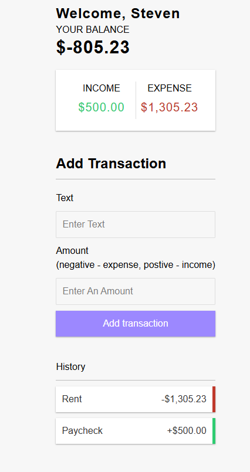

# 💸 Expense Tracker

A full-stack expense tracker web application that allows users to **add**, **delete**, and **view** transactions securely and efficiently. Built with modern technologies including **Next.js App Router**, **Prisma**, **Tailwind CSS**, **Clerk**, and **Neon**.

## ✨ Features

- ✅ User authentication with Clerk
- ➕ Add income or expense transactions
- ❌ Delete transactions with confirmation
- 💰 Automatically updates balance, income, and expenses
- ⚡ Built using Next.js App Router, Server Actions, and Client Components
- 🎨 Responsive design with Tailwind CSS
- 🗃️ Data stored in Neon (PostgreSQL) and queried with Prisma ORM

---

## 🖥️ Tech Stack

| Technology   | Description                                      |
|--------------|--------------------------------------------------|
| **Next.js**  | React framework using App Router & Server Components |
| **Tailwind CSS** | Utility-first CSS framework for modern UIs    |
| **Prisma**   | Type-safe ORM for database interaction            |
| **Neon**     | Serverless PostgreSQL database                    |
| **Clerk**    | User authentication and session management        |

---

## 🔐 Authentication

Clerk handles user registration, login, and session management. Only signed-in users can access and manage their own transactions.

---

## 📸 Demo

[Live Demo Not Working](https://your-vercel-deployment-url.vercel.app)



## 📦 Installation


1. **Clone the repository:**
   
```bash
git clone 
cd expense-tracker

npm install

Create .env

DATABASE_URL=your_neon_postgres_url
NEXT_PUBLIC_CLERK_PUBLISHABLE_KEY=your_clerk_publishable_key
CLERK_SECRET_KEY=your_clerk_secret_key

🔧 Setup
Generate Prisma client:

bash
Copy
npx prisma generate
Run the initial database migration:

npx prisma migrate dev --name init
Start the development server:

npm run dev
Your app will be running at http://localhost:3000

🗂 Folder Structure
app/
├── components/         # Reusable client/server components
├── actions/            # Server actions (e.g., add/delete transactions)
├── styles/             # Global and Tailwind CSS setup
├── lib/                # Utility functions
├── types/              # TypeScript types
.env                    # Environment variables (gitignored)
